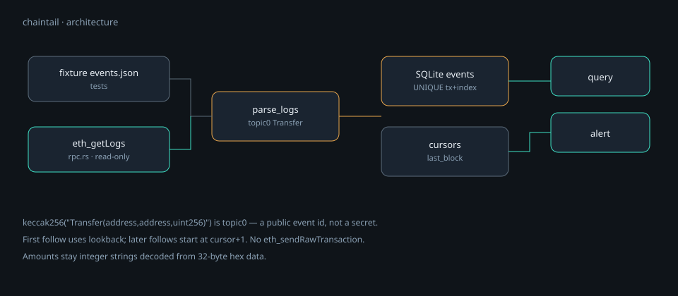

<p align="center">
  
</p>

<h1 align="center">chaintail</h1>

<p align="center">
  <strong>Local-first, read-only chain event tail.</strong><br>
  <code>tail -f</code> for one contract, into SQLite on your machine.
</p>

<p align="center">
  <a href="README.md"><strong>English</strong></a> ·
  <a href="README.zh-CN.md">中文</a> ·
  <a href="learn/README.md">Learn</a> ·
  <a href="docs/PROJECT-PLAN.md">Plan</a> ·
  <a href="SECURITY.md">Security</a>
</p>

<p align="center">
  
  
  
  
</p>

---

Point it at a contract address. It follows `eth_getLogs` into a local SQLite file. You can `query` and `alert`. No validator, no keys, no broadcast.

> Think `tail -f` for a chain. v0.1 is one EVM (fixture or a public RPC). It is not an indexer company.

## Why this exists

Explorers are fine until you want *your* watchlist on *your* disk, with a query you can run offline. Full-chain indexers are a different product: ops, backfill, and a bill. chaintail indexes one address you named.

On Ethereum-style chains, ERC-20 `Transfer` is:

```text
keccak256("Transfer(address,address,uint256)")
= 0xddf252ad1be2c89b69c2b068fc378daa952ba7f163c4a11628f55a4df523b3ef
```

That topic0 is a public signature hash, not a secret. Amounts live in `data` as 32-byte big-endian integers and stay integer strings in SQLite.

## Features

| | |
|---|---|
| **Local SQLite** | Bundled `rusqlite`. The address list never has to leave your disk. |
| **Idempotent ingest** | `UNIQUE (chain, tx, log_index)` + `INSERT OR IGNORE`. |
| **Cursor** | First run uses `--lookback`; later runs start at `last_block + 1`. |
| **Integer amounts** | Hex `data` → decimal string. No `parseFloat`. |
| **Fixture and RPC meet at ingest** | Recorded `eth_getLogs` JSON proves decoding without burning quota. |

## How it works

<p align="center">
  
</p>

JSON-RPC used: `eth_blockNumber`, `eth_getLogs`. Never `eth_sendRawTransaction`.

## Requirements

- [Rust](https://www.rust-lang.org/tools/install) **1.85**
- A public EVM RPC URL for live follow (the fixture path needs none)

```bash
git clone https://github.com/toolazytoname/chaintail.git
cd chaintail
cargo test
```

## Quick start

**Fixture (offline):**

```bash
cargo run -- follow \
  --config fixtures/config.ok.json \
  --fixture fixtures/events.json \
  --db /tmp/ct.sqlite

cargo run -- query \
  --config fixtures/config.ok.json \
  --db /tmp/ct.sqlite \
  --fail
```

`--fail` keeps rows with `ok=false` (the canned `0xccc` transfer in the fixture).

**Live (Base public RPC + USDC, read-only):**

```bash
cargo run -- follow \
  --config fixtures/config.ok.json \
  --rpc --lookback 50 \
  --db /tmp/ct.sqlite

cargo run -- query \
  --config fixtures/config.ok.json \
  --db /tmp/ct.sqlite
```

Run `--rpc --lookback 3` twice. The second `rows` count should be much smaller: the cursor already advanced.

## Configuration

`fixtures/config.ok.json` (safe to copy; it has no keys):

```json
{
  "chain": "base",
  "db": "chaintail.sqlite",
  "rpc_url": "https://mainnet.base.org",
  "address": "0x833589fCD6eDb6E08f4c7C32D4f71b54bdA02913",
  "notify": { "kind": "file", "path": "alerts.jsonl" }
}
```

The example `address` is native USDC on Base. Swap it for another ERC-20 — `Transfer` topic0 is usually the same.

## CLI

| Command | Purpose |
|---|---|
| `init --dir .` | Write a starter `config.json`. |
| `doctor --config FILE` | Reject forbidden secret field names. |
| `follow --config FILE --fixture FILE --db PATH` | Ingest canned logs. |
| `follow --config FILE --rpc [--lookback N] --db PATH` | Pull `eth_getLogs` from `rpc_url`. |
| `query --config FILE --db PATH [--fail] [--min-amount N]` | Print matching rows. |
| `alert --config FILE --db PATH [--notify-file PATH]` | Write matches as JSONL. |

Omitting `--fixture` also takes the live RPC path (same as `--rpc`), provided `rpc_url` and `address` are set.

## Tests

```bash
cargo test
```

Decoding is pinned on `fixtures/eth_logs.json`. Re-running ingest against the same SQLite file must not duplicate rows.

## Security

Read **[`SECURITY.md`](SECURITY.md)**. No private keys, signing, or broadcast. Amounts are integer smallest units; floating-point money math is a defect. The SQLite file is yours — v0.1 does not upload it.

## Non-goals

- Run a full node, or “open-source Helius”
- Private keys, signing, broadcast
- Historical full-chain backfill in v0.1
- A ten-chain abstraction on day one
- Arbitrary ABI decoding (that is a later, explicit ABI file — not a generic indexer)

## Learn

[`learn/`](learn/) covers LOG vs accounts, topic0, and why `0xf4240` is 1 USDC at 6 decimals. Cover animation: [`learn/assets/cover.mp4`](learn/assets/cover.mp4).

## Related

- [hlsentry](https://github.com/toolazytoname/hlsentry) — Hyperliquid liquidation sentry
- [oddsradar](https://github.com/toolazytoname/oddsradar) — prediction-market spread radar
- [slotbench](https://github.com/toolazytoname/slotbench) — Solana RPC relative-arrival stopwatch

## License

[MIT](LICENSE) © 2026 toolazytoname
