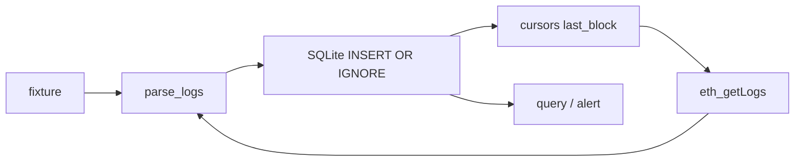

# 学习模块 · chaintail


[封面动画 6s](assets/cover.mp4)

## 架构




```bash
cd chaintail
cargo test
cargo run -- follow --config fixtures/config.ok.json --fixture fixtures/events.json --db /tmp/ct.sqlite
cargo run -- query --config fixtures/config.ok.json --db /tmp/ct.sqlite --fail
# 真链（Base 上的 USDC）
cargo run -- follow --config fixtures/config.ok.json --rpc --lookback 5 --db /tmp/ct.sqlite
```

`--fail` 应只留下 fixture 里那笔 `ok=false` 的 `0xccc`。

---

## 场景：账户模型和「事件」

以太坊系没有「给一个程序 id 就能 tail 日志」这么舒服的抽象。合约用 `LOG` 指令往收据上写事件。浏览器能画 Transfer，是因为大家约定了同一套 ABI。

最常见的一条：

```text
Transfer(address indexed from, address indexed to, uint256 value)
```

`indexed` 的参数进 `topics`，没 indexed 的 `value` 进 `data`。  
事件 id（topic0）是：

```text
keccak256("Transfer(address,address,uint256)")
= 0xddf252ad1be2c89b69c2b068fc378daa952ba7f163c4a11628f55a4df523b3ef
```

这不是密钥，是全网公开的函数签名哈希。`src/rpc.rs` 里的 `TRANSFER_TOPIC` 就是它。

节点通过 JSON-RPC 说话：`eth_blockNumber`、`eth_getLogs`。我们只读这两样，不 `eth_sendRawTransaction`。

---

## 知识点 → 代码落点

| 词 | 人话 | 落在哪 |
|---|---|---|
| JSON-RPC | HTTP POST 一个 `{method, params, id}` | `RpcClient::call` |
| 十六进制数量 | 链上整数常写成 `0x10` | `parse_hex_u64`、`data_amount_dec` |
| 收据日志 | 交易成功才会出现（失败一般没业务 LOG） | live 路径里 `ok: true` |
| 幂等入库 | 同一 `(chain, tx, log_index)` 只能有一行 | SQLite `UNIQUE` + `INSERT OR IGNORE` |
| 游标 | 记住扫到哪一块，下次接着 | 表 `cursors` |

`data` 里的金额是 32 字节大端十六进制。`0xf4240` = 1_000_000，对 6 位小数的 USDC 就是 1 USDC。不要 `parseFloat`。

---

## 设计

- **本地 SQLite 当穷人版索引。** 不为全链做 The Graph，只 index 你点名的合约。范围小，才能一个人扛正确性。
- **游标比每次 lookback 重扫重要。** 第一次用 lookback 热身，之后 `last_block+1`。否则要么漏、要么把公共 RPC 打爆。
- **fixture 和 RPC 在 `ingest` 处汇合。** 解码测 `fixtures/eth_logs.json`，不用每次烧节点额度。

精读：`parse_logs` + `data_amount_dec`；`store.rs` 的 UNIQUE。

---

## 动手

1. 算一下 `0xf4240` 是不是 1000000（fixture 里那笔）。
2. 连续跑两次 `--rpc --lookback 3`，第二次的 `rows` 应远小于第一次（只吃新块）。
3. 把 config 的 `address` 换成另一个 ERC-20，看 topic0 是否仍是同一个 Transfer（大多数是）。

---

## 故意没做

自建节点、全历史回填、解码任意 ABI。要解码任意事件，下一步是「带一份 ABI」，不是先上通用索引器。
